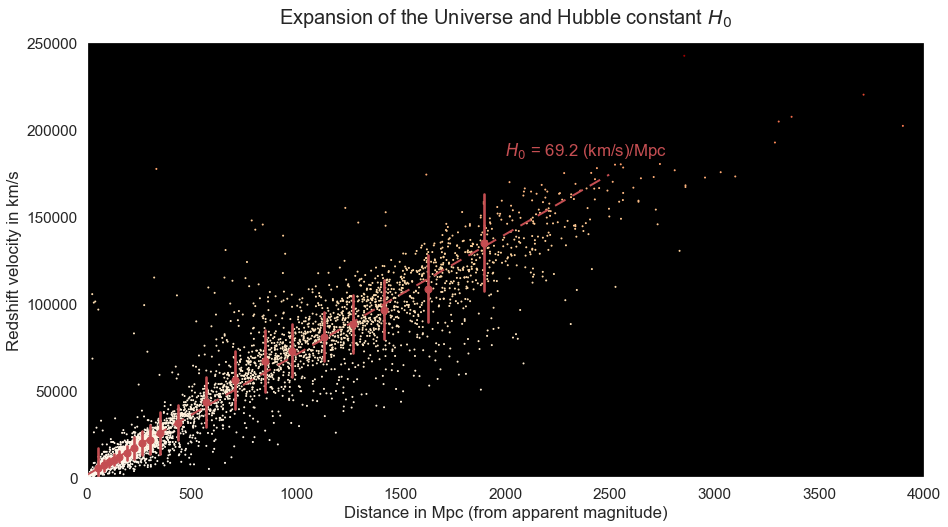

# Finding the Age of the Universe using Supernova Data

#### This notebook uses redshift and maximum apparent magnitude measurementsof type IA Supernovae from the __[Open Supernova Catalog](https://sne.space/)__ to estimate the Age of the Universe at 14.6 billion years (within 6% of the generally accepted value: __[13.8 billion years](https://en.wikipedia.org/wiki/Age_of_the_universe)__).  

## Introduction

A __[type IA Supernova](https://en.wikipedia.org/wiki/Type_Ia_supernova)__ is a type of supernova which results from the accretion of material by a white dwarf from its companion in binary systems. As the white dwarf gains mass, its temperature increases until it reaches a critical temperature at which runaway Carbon fusion starts. Type IA supernovae can be distinguished from other types of supernovae by looking at their lightcurve (i.e. apparent magnitude as a function of time).

Because their trigger mechanism always occur in the approximately same conditions, they all have a similar intensity. For this reason, they are known as __[standard candles](https://en.wikipedia.org/wiki/Cosmic_distance_ladder#Standard_candles)__ and are very useful for measuring the distance to their host galaxy because their apparent magnitude as seen from earth is directly linked to their distance from us. 

Thanks to this property and their extreme luminousity, type IA supernovae can be used to determine the age of the universe by measuring their __[apparent magnitude](https://en.wikipedia.org/wiki/Magnitude_%28astronomy%29#Apparent_magnitude)__ and __[redshift](https://en.wikipedia.org/wiki/Redshift)__ (linked to their velocity away from us caused by the expension of the universe). 

## Description and Main Results

The data is obtained from __[this Open Supernova Database link](https://api.sne.space/catalog?format=CSV)__.

The first step in this analysis is to convert redshift and apparent magnitude measurements into velocity and distance, respectively. Redshift measurements are converted into velocity using __[the following special relativity formula](https://en.wikipedia.org/wiki/Redshift#Redshift_formulae)__: $1+ z = \sqrt{\frac{1+v/c}{1-v/c}}$, which can be rewritten as: $v = c  \frac{(1+z)^2 - 1}{(1+z)^2 + 1}$, where $z$ is the redshift, $v$ is the velocity of the redshifted object from the observer, and $c$ is the speed of light.

Maximum apparent magnitude measurements are converted into distance from the observer by applying the following definition: $m - M = 5 \log{\frac{d}{10}}$, or $d = 10^{\frac{5 + m - M}{5}}$, where $m$ and $M$ are the apparent and absolute maximum magnitude of the supernova, respectively, and $d$ is its distance in Parsec (pc).

The typical maximum absolute magnitude ($M$) of type IA supernovae can be known by estimating the distance of relatively close supernovae, which distance are known thanks to other standard candles (e.g. __[Ceipheid variable stars](https://en.wikipedia.org/wiki/Cepheid_variable)__). In practice, the average absolute magnitude of type IA supernovae from the Open Supernova Database is considered in this analysis (M = -18.9).

Above is a  3D plot of all type Ia supernovae in the Open Supernova Catalog, created with Plotly (a dynamic version of this 3D plot is available __[here](./images/3D_view_type_Ia_supernovae.html)__). It shows that the further a type Ia supernova is from the Milky Way, the more redshifted it tends to be (represented with the red color) . This 3D graph also shows that most distant type Ia supernovae are detected in very narrow beams. This is probably due to the fact that the search for distant supernovae is concentrated in very small regions of the sky (it would be impractical to monitor supernovae in every direction because the search for distant supernovae requires powerful telescopes over long periods of time). Furthermore, it clearly shows that few supernovae are detected in the galactic plane due to the __[strong extinction caused by dust in the Milky Way](https://en.wikipedia.org/wiki/Zone_of_Avoidance)__. This 3D plot required the conversion of declination and right ascension from sexagesimal (i.e. hour:minute:second) to decimal, and then the conversion to carthesian coordinates using the following equations (where $d$ is the distance, $\theta$ is the declination, and $\phi$ is the right ascension): 
- $x = d \sin(\theta) \cos(\phi)$ 
- $y = d \sin(\theta) \sin(\phi)$ 
- $z = d \cos(\theta)$ 

In the graph below, the velocity infered from redshift is plotted as a function of the distance to the type Ia supernova

Then, the linear relationship between distance and velocity of type IA supernova is determined using a __[random sample consensus (RANSAC)](https://en.wikipedia.org/wiki/Random_sample_consensus)__   algorithm in order to exclude clear outliers from the linear fit. This relationship which corresponds to the expansion rate of the universe per unit distance, is known as the Hubble constant ($H_0$) and is expressed in (km/s)/Mpc. This calculation resulted in an estimate for the Hubble constant of 66.8 (km/s)/MPc, which is very close to the commonly accepted value of this parameter (~70 (km/s)/MPc).

In the standard The lookback time (i.e. the time when the light was emitted from a luminous object) as a function of redshift is expressed as follows:

$ t_L = \cfrac{1}{H_0} {\displaystyle\int_{0}^{z} \cfrac{dz'}{(1+z')\sqrt{\Omega_M(1+z')^3 + \Omega_k(1+z')^2 + \Omega_\Lambda}}}$

, where $t_L$ is the lookback time for a redshift of $z$, $H_0$ is the Hubble constant, $\Omega_M$ is the mass density of the universe, $\Omega_\Lambda$ is the cosmological constant (term caused by the dark energy) and $\Omega_k$ is the curvature of space.

This equation can be simplified by assuming that the universe is flat ($\Omega_k + \Omega_M + \Omega_\Lambda = 1$) and empty ($\Omega_M = \Omega_\Lambda = 0$), meaning that the universe has been expanding at the constant rate H0 since the Big Bang and that the observed redshift is not caused by the attraction between massive objects or by dark energy. The equation then becomes:

$ t_L = \cfrac{1}{H_0} {\displaystyle\int_{0}^{z} \cfrac{dz'}{(1+z')^2}} = \cfrac{1}{H_0} \left(1 -\cfrac{1}{1+z}\right)$

By integrating the redshift over infinity, we obtain the Age of the Universe according to this simplified model:

$ t_0 = \cfrac{1}{H_0} {\displaystyle\int_{0}^{\infty} \cfrac{dz'}{(1+z')^2}} = \cfrac{1}{H_0}$ = 14.6 billion years

This value is only 6% of the commonly accepted value of 13.8 billion years derived using the Lambda CDM model.

The graph below shows the lookback time of type Ia supernova (calculated using the above simplified equation for $t_L$ based and redshift measurements) as a function of the comoving distance (obtained using maximum apparent magnitude measurements). This graph also displays the lookback time vs distance, predicted by the empty universe model taking into account the following relationship between comoving distance and redshift:

$d_c = \cfrac{c}{H_0} {\displaystyle\int_{0}^{z} \cfrac{dz'}{(1+z')}} = \cfrac{c}{H_0} \ln(1+z)$
 

In this graph, when the redshift becomes infinitely large (i.e. for "light" emitted immediately after the Big Bang, when the Universe was infinitely small), the lookback time converges to the predicted age of the Universe (14.3 billion years).

This simplified model is surprisingly accurate to find the lookback time up to now and ultimately, the age of the universe, when compared to the generally accepted Lambda CDM model ($\Omega_\Lambda = 0.73$, $\Omega_M = 0.27$ and $\Omega_k = 0$). This is due to the fact that, on average, phases of accelerating expension of the universe have been canceled out by the action of gravity between massive objects). However, the empty universe model is expected to diverge from the Lambda CDM model in the future as the universe becomes dominated by dark energy, causing it to expand at an exponential rate.
